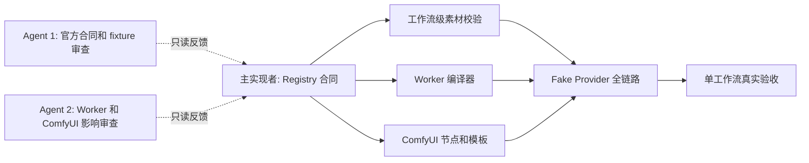

# Seedance 工作流开发提速策略（2026-09-14）

> 归档说明：本文依赖旧 W2–W6 顺序和 `preview_only / production_verified / disabled` 单状态，已被 [开发工作流](../DEVELOPMENT_WORKFLOW.md)、[统一需求规范 v2](../requirements/2026-09-15/workflow-preview-production-spec-v2.md)和[当前 ROADMAP](../ROADMAP.md)取代。本文只保留历史决策过程，不得用于当前实现或准入判断。
>
> 用途：记录本项目如何使用主实现者、并行 Agent 与 Skills 加快 Seedance 2.5 工作流开发，同时保持 Backend、Worker 与 ComfyUI 的接口一致。本文件是架构与协作参考，不描述当前系统能力；当前事实见 [PROJECT_STATUS.md](../PROJECT_STATUS.md)，唯一实施计划见 [ROADMAP.md](../ROADMAP.md)。

## 1. 结论

当前速度瓶颈不是单个文件的编码速度，而是同一个工作流合同会同时影响 Backend Registry、Worker Ark payload 与 ComfyUI 节点。多名 Agent 同时改这三个边界会产生不同字段解释，反而增加返工。

推荐采用：**一个主实现者维护工作流合同，两个只读 Agent 并行做证据与影响审查；合同冻结后，再按模块并行实现。**



## 2. 为什么不能先并行改代码

一个工作流的下列内容必须只有一个来源：素材 role、数量与互斥关系、generation 参数、Provider 字段、结果字段和生命周期状态。

例如视频编辑必须同时满足：

- Registry 要求至少一段 `reference_video`；
- Asset policy 要求源视频 4–30 秒；
- generation 固定 `ratio="adaptive"` 与 `duration=-1`；
- Worker 才可编译 `omni_reference_task_type="edit"`；
- ComfyUI 节点才显示视频输入，不显示首帧/尾帧槽位；
- 真实验收才可改变其 `disabled` 状态。

如果这些规则由不同 Agent 各自实现，就会出现“节点能填、Backend 能建 Preview、Worker 参数不兼容”的重复问题。

## 3. 推荐开发顺序

### 阶段 A：主线连续开发

先完成 W2 和 W3 的合同层，暂不进入真实 Provider 调用。

1. **W2 工作流级素材校验**
   - 多段视频与音频总时长不超过 30 秒；
   - 各类素材数量上限；
   - 编辑视频 4–30 秒；
   - 首帧/尾帧与 `reference_*` 角色互斥；
   - 创建任务前再次核对 actor 所有权、上传状态与 `mediaMetadata`。

2. **W3 完整 Registry policy**
   - 拆为 `WorkflowDefinition`、`MediaPolicy`、`GenerationPolicy`、`ProviderFieldPolicy`；
   - 每种 workflow 明确允许角色、数量、ratio、duration、可选输出字段和状态；
   - `disabled` 不允许创建 Preview 或 Production；
   - `preview_only` 可创建不可执行 Preview；
   - `production_verified` 才能通过白名单和额度闸门创建 pending 任务。

这两项完成后，合同稳定，Worker 与 ComfyUI 才可安全并行。

### 阶段 B：只读并行准备

在阶段 A 期间，可由独立 Agent 并行完成以下不改主线的任务：

| Agent | 任务 | 输出 |
| --- | --- | --- |
| Agent 1 | 逐条复核官网 PDF、SDK/HTTP 示例和当前 fixture | 每个 workflow 的最小 payload、结果字段、缺口清单 |
| Agent 2 | 审查 Worker 现有 `SeedanceAdapter`、`executor` 和测试 | 按 Registry 编译所需的最小改动、风险与测试清单 |
| Agent 3 | 审查 ComfyUI 客户端、节点和模板 | 八类节点输入、Preview/Production 可见性、模板缺口 |

输出先作为审查报告，由主实现者合并结论；这些 Agent 不同时改 `workflow-registry.ts`、公共 DTO 或 Worker payload 合同。

### 阶段 C：合同冻结后模块并行

| 负责人 | 实现范围 | 前提 |
| --- | --- | --- |
| 主实现者 | Registry、任务控制器、素材 policy、集成测试 | 阶段 A 完成 |
| Worker 实现者 | Registry snapshot → Ark `content[]` / Provider fields、payload fixtures | ProviderFieldPolicy 冻结 |
| ComfyUI 实现者 | 节点输入、模板、客户端 pytest | MediaPolicy 与 GenerationPolicy 冻结 |
| 审查 Agent | 对照官方字段、测试覆盖和安全边界 | 每次模块提交后 |

最终由主实现者运行三包全量测试与 Fake Provider 全链路，再决定是否进入一次受控真实验收。

## 4. Skills 的正确用途

| Skill/能力 | 用于 | 不用于 |
| --- | --- | --- |
| TDD | role 互斥、时长、总量、generation、payload shape、错误路径 | 用测试替代真实 Ark 验收 |
| 系统化调试 | Provider 4xx/5xx、测试失败、任务状态异常、一次真实验收的故障归因 | 通过反复重发付费任务试错 |
| 执行计划与验证门禁 | W4/W5/W6 的分阶段完成、回归与真实验收前检查 | 跳过既有安全闸门 |
| Seedance 2.5 提示词 Skill | 创意端 prompt helper、分镜与素材职责表达 | 定义 Backend 参数、费用或权限规则 |
| Agent Teams | 只读调研、独立模块实现、提交后审查 | 多人同时修改共享合同文件 |

## 5. 每个工作流的固定门禁

每种新 workflow 必须依次经过：

```text
官方字段证据
→ Registry 合同与纯函数测试
→ Asset metadata / workflow policy 校验
→ Worker payload fixture
→ Fake Provider 全链路
→ ComfyUI 模板与客户端测试
→ 单次、明确预算上限的真实任务
→ 结果、尾帧、usage、费用、OSS 转存核对
→ production_verified
```

这使失败停在最便宜、最可回归的层级；真实任务仅用于证明本账号、当前模型和当前部署的最终可用性。

## 6. 不建议的加速方式

- 不让多个 Agent 同时修改 `workflow-registry.ts`、公共 DTO、Worker payload 编译；
- 不先批量生成八个 ComfyUI 模板再补素材校验；
- 不因官网字段完整就批量开放 Preview 或 Production；
- 不在没有 Fake Provider fixture 的情况下直接测试 Ark；
- 不反复启动全套服务验证纯函数和 payload 规则。

## 7. 当前建议的下一步

先同步 W2 已落地的 `mediaMetadata`、`ffprobe` 与基础媒体校验进路线图，再连续完成 W2 剩余的总量、总时长、角色互斥和创建前 Asset 校验。随后完成 W3 的完整 policy 拆分。完成这两项后，按第 3 节阶段 C 并行推进 Worker 与 ComfyUI。
